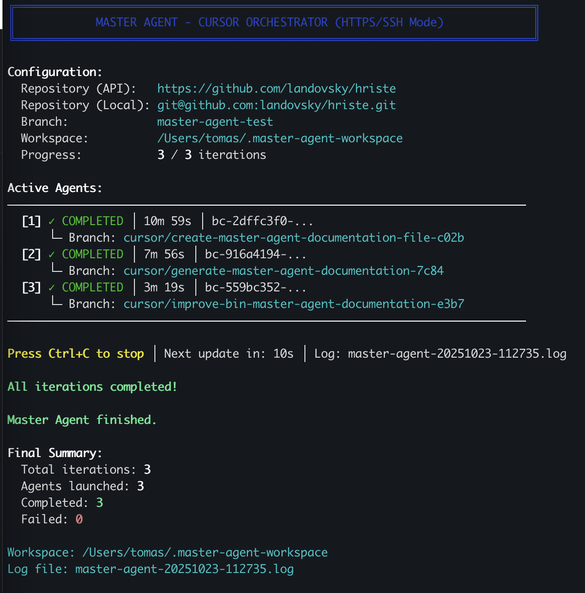

# Cursor background agents orchestrator
Run locally to get Cursor background agents to work on defined set of tasks.

## Motivations
1) get AI to do more unattended work in small, manageable chunks
1) decrease number of "one minute breaks" while using AI in "attended mode"
1) increase AI utilization (get the most of your Cursor plan)

## How it works
1) background agents operate in iterations defined by a JSON spec (see `master-agent-spec.example.json`)
1) the script starts Cursor background agents sequentially after the previous agent has completed
1) each agent works in its own repository; the script merges their work into a base "epic" branch
1) keep your computer awake while work is in progress

## Getting started
1) setup environment variables (Cursor API key, Github personal access token) - see `.env.example`
1) define tasks (follow `master-agent-spec.example.json`)
